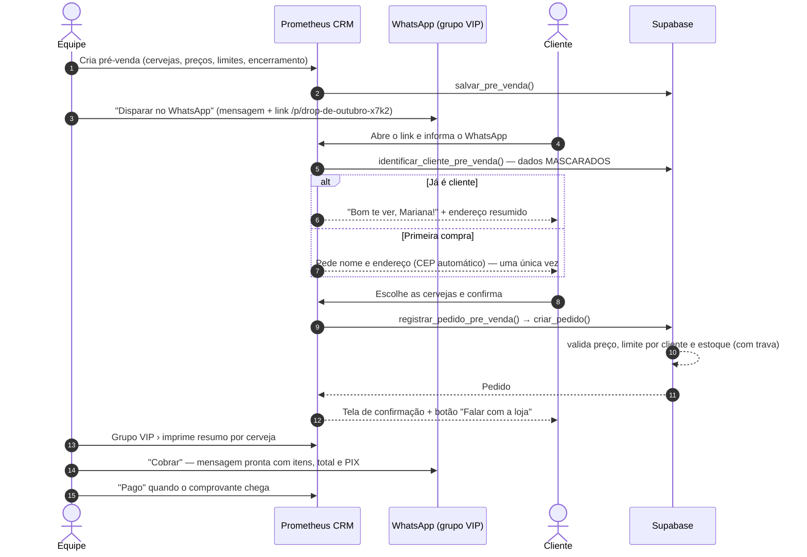
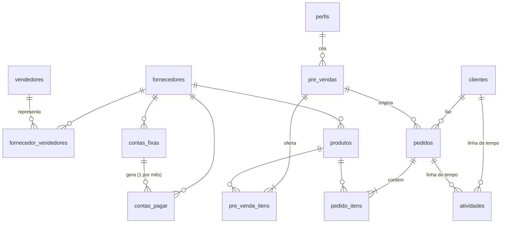

<p align="center">
  
</p>

<h3 align="center">Prometheus CRM</h3>
<p align="center">CRM integrado · Shopify · App · Grupo VIP<br/>Clientes, fornecedores, contas a pagar e <strong>pré-vendas por link no WhatsApp</strong>.</p>

---

## Sumário

1. [Visão geral](#1-visão-geral)
2. [Stack](#2-stack)
3. [Começo rápido (passo a passo)](#3-começo-rápido-passo-a-passo)
4. [Estrutura de pastas](#4-estrutura-de-pastas)
5. [Funcionalidades](#5-funcionalidades)
6. [Pré-venda por link (fluxo completo)](#6-pré-venda-por-link-fluxo-completo)
7. [Banco de dados](#7-banco-de-dados)
8. [Autenticação e equipe](#8-autenticação-e-equipe)
9. [Mensagens de WhatsApp](#9-mensagens-de-whatsapp)
10. [Deploy: Supabase + Vercel + GitHub](#10-deploy-supabase--vercel--github)
11. [Integrações (n8n, Shopify, App, API)](#11-integrações-n8n-shopify-app-api)
12. [Identidade visual](#12-identidade-visual)
13. [Scripts](#13-scripts)
14. [Segurança e LGPD](#14-segurança-e-lgpd)
15. [Solução de problemas](#15-solução-de-problemas)
16. [Próximos passos sugeridos](#16-próximos-passos-sugeridos)

---

## 1. Visão geral

O Prometheus CRM é o sistema interno da loja para:

| Módulo | O que faz |
|---|---|
| **Visão geral** | Receita do mês (vs. mês anterior), pedidos, valores a receber, contas do mês, gráfico de receita semanal por canal, “precisa de atenção”, pedidos e atividades recentes. |
| **Clientes** | Cadastro manual completo (dados, WhatsApp, endereço com busca de CEP, VIP, tags). Ficha com LTV, ticket médio, pedidos, linha do tempo e envio de pré-venda personalizada. |
| **Banco de Leads** | Pastas com listas de contatos importadas de **CSV, Excel (XLS/XLSX) ou TXT**: prévia antes de importar, detecção das colunas (nome, WhatsApp, e-mail), WhatsApp normalizado, números repetidos ignorados, busca em qualquer coluna e selo de quem já é cliente — base para os disparos. |
| **Fornecedores** | Empresas (cervejarias, distribuidoras, serviços) e **vendedores** que atendem a loja, com as **empresas que cada um representa** (uma ou várias). |
| **Contas a pagar** | Contas **fixas** (geradas automaticamente todo mês) e **variáveis** (avulsas, com parcelamento), navegação **mês a mês**, situação (em dia / vence logo / vencida / paga). |
| **Produtos** | Catálogo de cervejas com estilo, volume, teor, preço, imagem (Supabase Storage), SKU e IDs da Shopify. |
| **Pré-vendas** ⭐ | Campanha com cervejas, preço, limite por cliente e estoque → **link público para disparar no WhatsApp**. O cliente escolhe, informa endereço **uma única vez** e o pedido cai no CRM. |
| **Pedidos** | Todos os canais (Grupo VIP, WhatsApp, Loja, Shopify, App), status operacional, pagamento, cobrança com mensagem pronta, impressão. Pedido manual com busca de cliente. |
| **Grupo VIP** | Vendas do grupo, **quantidade por cerveja/modelo**, filtros por pré-venda/período/pagamento, **impressão** (resumo + lista de separação) e **cobranças**. |
| **Configurações** | Dados da loja, PIX, modelos de mensagem, webhooks (n8n), fila de eventos, API, Shopify e equipe (convites e acessos). |

Referências visuais do Brand Kit: [`docs/referencias/mockup-desktop.png`](docs/referencias/mockup-desktop.png) e [`docs/referencias/mockup-mobile.png`](docs/referencias/mockup-mobile.png).

---

## 2. Stack

| Camada | Tecnologia |
|---|---|
| Front + servidor | **Next.js 16** (App Router, Server Components, Server Actions, `proxy.ts`), **React 19**, TypeScript |
| Estilo | **Tailwind CSS v4** com os tokens da marca (`src/app/globals.css`) |
| Banco, Auth e Storage | **Supabase** (Postgres 17, RLS, funções SQL, Storage) via `@supabase/ssr` |
| Validação | **Zod 4** |
| Ícones | `lucide-react` |
| Hospedagem | **Vercel** (região `gru1` — São Paulo), Cron para a fila de eventos |
| Código | **GitHub** + GitHub Actions (lint, tipos e build a cada push) |

---

## 3. Começo rápido (passo a passo)

> Pré-requisitos: **Node.js 20.9+** (recomendado 24), **npm**, conta no **Supabase**, **Vercel** e **GitHub**.
> Opcional: [Supabase CLI](https://supabase.com/docs/guides/cli) (`brew install supabase/tap/supabase`).

### 3.1 Instalar

```bash
npm install
cp .env.example .env.local
```

### 3.2 Preencher o `.env.local`

| Variável | Onde pegar |
|---|---|
| `NEXT_PUBLIC_SUPABASE_URL` | Supabase › Project Settings › API → `https://uljyhexcghvfzgobznkt.supabase.co` |
| `NEXT_PUBLIC_SUPABASE_PUBLISHABLE_KEY` | Supabase › Project Settings › **API Keys** → *Publishable key* (`sb_publishable_...`) |
| `SUPABASE_SECRET_KEY` | Supabase › Project Settings › **API Keys** → *Secret key* (`sb_secret_...`) — **nunca** exponha |
| `NEXT_PUBLIC_SITE_URL` | `http://localhost:3000` no seu computador; o domínio do CRM em produção |
| `INTEGRATIONS_API_KEY` | opcional — gere com `openssl rand -hex 32` (API `/api/v1`) |
| `CRON_SECRET` | opcional — gere com `openssl rand -hex 32` (rotina de eventos) |
| `SHOPIFY_WEBHOOK_SECRET` | opcional — Shopify › Configurações › Notificações › Webhooks |

### 3.3 Criar o banco (migrations)

O seu projeto Supabase **Prometheus CRM** (`uljyhexcghvfzgobznkt`, região São Paulo) já recebeu a **primeira migration (`base`)**. As demais são aplicadas assim:

```bash
supabase login
supabase link --project-ref uljyhexcghvfzgobznkt
supabase db push        # aplica as migrations que faltam, na ordem
```

> Sem o CLI? Abra **Supabase › SQL Editor** e execute, **na ordem**, cada arquivo de `supabase/migrations/` a partir de `20261001223100_fornecedores.sql` (a `base` já foi aplicada). Neste caso o CLI não saberá quais foram aplicadas — prefira o `db push`.

**Dados de demonstração (opcional):** `supabase/seed.sql` cria fornecedores, cervejas, clientes, uma pré-venda “Drop de Outubro”, pedidos e contas. Em produção, só rode no SQL Editor se quiser exemplos (dá para apagar depois).

### 3.4 Criar o primeiro usuário (administrador)

Supabase › **Authentication › Users › Add user › Create new user** (marque *Auto Confirm User*).
O **primeiro usuário vira administrador automaticamente**. Os próximos entram por convite (seção 8).

### 3.5 Rodar

```bash
npm run dev     # http://localhost:3000
```

### 3.6 Desenvolvimento 100% local (opcional, requer Docker)

```bash
npm run db:start        # sobe Supabase local (Studio em http://localhost:54323)
npm run db:reset        # recria o banco com migrations + seed
npm run db:types:local  # regenera os tipos TypeScript
```

---

## 4. Estrutura de pastas

```
.
├── supabase/
│   ├── migrations/                 # Schema versionado (SQL) — fonte da verdade do banco
│   │   ├── 20261001223031_base.sql                 # funções utilitárias, perfis, configurações
│   │   ├── 20261001223100_fornecedores.sql         # fornecedores, vendedores, vínculo N:N
│   │   ├── 20261001223200_contas_pagar.sql         # contas fixas/variáveis, geração mensal
│   │   ├── 20261001223300_clientes_produtos.sql    # clientes, produtos
│   │   ├── 20261001223400_pre_vendas_pedidos.sql   # pré-vendas, pedidos, timeline, RPCs, views
│   │   ├── 20261001223500_integracoes.sql          # webhooks, fila de eventos, Shopify
│   │   └── 20261001223600_permissoes_storage.sql   # grants e bucket de imagens
│   ├── templates/                  # E-mail de recuperação de senha (pt-BR)
│   ├── seed.sql                    # Dados de demonstração
│   └── config.toml                 # Supabase local
├── src/
│   ├── app/                        # Rotas (finas: só montam a tela)
│   │   ├── (crm)/                  # Área logada (sidebar)
│   │   │   ├── page.tsx            # Visão geral
│   │   │   ├── clientes/  fornecedores/  contas/  produtos/
│   │   │   ├── pre-vendas/  pedidos/  grupo-vip/  configuracoes/
│   │   ├── p/[slug]/               # ⭐ Página PÚBLICA da pré-venda (link do WhatsApp)
│   │   ├── login/  redefinir-senha/  sem-acesso/  auth/confirm/
│   │   └── api/                    # health, cron/eventos, webhooks/shopify, v1/*
│   ├── features/                   # Regras de negócio por domínio
│   │   └── <dominio>/
│   │       ├── queries.ts          # Leituras (server-only)
│   │       ├── actions.ts          # Server Actions (mutações)
│   │       ├── schema.ts           # Validação (zod)
│   │       └── components/         # Componentes do domínio
│   ├── components/
│   │   ├── ui/                     # Primitivos (Button, Card, Badge, Table, Kpi...)
│   │   ├── form/                   # ActionForm, Field, Input, AddressFields...
│   │   ├── layout/                 # Sidebar
│   │   ├── marca/                  # Logo e Ícone oficiais
│   │   └── dominio/                # Linha do tempo
│   ├── lib/                        # supabase/, auth, env, format, datas, whatsapp, validacao...
│   ├── types/                      # database.types.ts (gerado) + apelidos
│   └── proxy.ts                    # Sessão do Supabase + proteção das rotas
├── public/brand/                   # Arquivos oficiais da marca (logos, ícones, banner)
├── docs/referencias/               # Mockups do Brand Kit
├── vercel.ts                       # Configuração da Vercel (região, cron)
└── .github/workflows/ci.yml        # CI: lint + tipos + build
```

**Convenções**

- Nomes de domínio em **português** (`clientes`, `salvarCliente`, `FormularioCliente`); primitivos de UI em inglês (`Button`, `Card`).
- Toda Server Action começa com `exigirEquipe()` (ou `exigirAdmin()`), valida com zod e devolve `EstadoAcao` (`ok`, `mensagem`, `erros` por campo).
- Formulários usam `<ActionForm>` + `<Field name="...">`: erros aparecem embaixo de cada campo e o que foi digitado não se perde.
- Datas sempre no fuso **America/Sao_Paulo** (`src/lib/datas.ts`); dinheiro e telefones formatados em `src/lib/format.ts`.

---

## 5. Funcionalidades

### Clientes
- Cadastro manual com **WhatsApp normalizado** (`(11) 98765-4321` → `5511987654321`) — é a chave que identifica o cliente no link de pré-venda.
- Endereço com **preenchimento automático pelo CEP** (ViaCEP).
- **VIP**, tags, observações, origem (manual, pré-venda, Shopify, App).
- Lista com busca (nome, e-mail, WhatsApp), filtro “Só VIP”, LTV e status de relacionamento (Ativo ≤ 60 dias, Em risco ≤ 120, Inativo).
- Ficha: LTV, pedidos, ticket médio, em aberto, endereço, **linha do tempo**, botão de mensagem e **“Enviar pré-venda”** (link personalizado que já traz o WhatsApp do cliente).

### Fornecedores e vendedores
- **Empresas**: nome, razão social, CNPJ, contato, cidade/UF, observações.
- **Vendedores**: nome, WhatsApp, e-mail e **empresas que representa** (marque várias ou cadastre novas digitando os nomes separados por vírgula — são criadas na hora).
- Cada empresa mostra quais vendedores a atendem.

### Contas a pagar
- **Fixas**: modelo com valor, dia de vencimento, início e fim opcional. Ao abrir um mês, o sistema **gera as contas fixas daquele mês** (sem duplicar). Em meses curtos, usa o último dia.
- **Variáveis**: lançamento avulso, com **parcelamento** (cria uma conta por mês: “Lote (1/3)”, “(2/3)”...).
- Navegação **mês a mês**, indicadores (total, pago, a pagar, vencido), botão **Pagar** de um clique, reabrir, editar e cancelar (fixa: cancela só aquele mês).
- Editar o modelo fixo pode atualizar as contas pendentes do mês atual em diante.

### Produtos
- Cervejas com estilo, cervejaria, volume, teor, preço, descrição, **imagem** (upload para o bucket público `produtos`), SKU e IDs da Shopify (produto/variante).

### Pedidos
- Lista com filtros (canal, pagamento, status) e busca por número/cliente.
- Detalhe: itens, totais, endereço “congelado” do pedido, status operacional (novo → confirmado → separado → entregue / cancelado), **pagamento** (forma + confirmação), **cobrança pelo WhatsApp** (abre a conversa com a mensagem pronta e registra a cobrança), impressão e linha do tempo.
- **Pedido manual**: busca de cliente, venda avulsa (preço de catálogo) ou vinculada a uma pré-venda (preço, limites e estoque da pré-venda).
- Número amigável: `#PRM-10001`.

### Grupo VIP
- Todas as vendas com canal **Grupo VIP**, filtráveis por **pré-venda**, **período** e **situação do pagamento**.
- **Quantidade por cerveja/modelo** (para pedir ao fornecedor e separar) + total.
- Tabela de **cobranças**: itens de cada cliente, total, situação, quantas cobranças já foram enviadas, botões **Cobrar** (WhatsApp) e **Pago**.
- **Imprimir**: gera um relatório A4 com cabeçalho da marca, resumo por cerveja e a lista de separação por cliente (com caixinha “Separado”).

### Configurações
- **Loja e mensagens**: nome, WhatsApp da loja, chave PIX, favorecido e os modelos de mensagem (seção 9).
- **Integrações**: webhooks (n8n), fila de eventos com reenvio, instruções da Shopify, cron e API.
- **Equipe**: convites por e-mail, liberar/bloquear acesso, promover a admin, editar o próprio perfil.

---

## 6. Pré-venda por link (fluxo completo)



**Detalhes importantes**

- **Identificação pelo WhatsApp:** o cliente só precisa preencher os dados na primeira compra. Nas próximas, digita o número e o sistema puxa nome e endereço do cadastro.
- **Privacidade:** como o link é público, a tela mostra apenas o **primeiro nome** e um **endereço resumido/mascarado** (`Rua dos Pinh…, nº 1*** · Pinheiros`). E-mail, CPF e endereço completo nunca saem do servidor.
- **Outro endereço:** o cliente pode trocar o endereço de entrega; o novo endereço passa a ser o do cadastro (registrado na linha do tempo).
- **Preços e limites são validados no banco** (não dá para “burlar” pelo navegador). Estoque usa trava de linha (`for update`) para não vender além do disponível.
- **Grupo VIP:** quem compra por uma pré-venda com canal *Grupo VIP* passa a ser marcado como **VIP**.
- **Link personalizado:** `/p/drop-outubro?w=5511987654321` já preenche o WhatsApp (usado no botão “Enviar pré-venda” da ficha do cliente).
- **Encerramento:** após `encerra_em` (ou ao clicar “Encerrar”), o link mostra “pré-venda encerrada”.
- **Prévia no WhatsApp:** a página tem Open Graph com o banner da marca (`public/brand/banner-1500x500.png`).

---

## 7. Banco de dados

### 7.1 Diagrama



### 7.2 Tabelas

| Tabela | Descrição |
|---|---|
| `perfis` | Membros da equipe (1:1 com `auth.users`), papel `admin`/`equipe`, `ativo`, `trocar_senha` (entrou com senha temporária). |
| `configuracoes` | Linha única: loja, PIX, modelos de mensagem. |
| `fornecedores` | Empresas fornecedoras. CNPJ só dígitos, único. |
| `vendedores` | Representantes comerciais. |
| `fornecedor_vendedores` | N:N — empresas que cada vendedor representa. |
| `contas_fixas` | Modelos recorrentes (valor, dia, início/fim). |
| `contas_pagar` | Contas do mês (`competencia` = dia 1). `tipo` fixa/variável; `unique(conta_fixa_id, competencia)` evita duplicar. |
| `clientes` | `whatsapp` único e normalizado; endereço principal; VIP; tags; IDs Shopify/App. |
| `produtos` | Catálogo; `sku` e `shopify_variant_id` únicos. |
| `pre_vendas` | Campanhas; `slug` único (link `/p/{slug}`), canal, status, encerramento, taxa de entrega. |
| `pre_venda_itens` | Produtos ofertados: preço, limite por cliente, quantidade disponível, ordem. |
| `pedidos` | Todos os canais. `numero` sequencial (10001+), `total` calculado, endereço “congelado”, cobranças, pagamento, `shopify_order_id`. |
| `pedido_itens` | Itens com nome/preço do momento da venda. Subtotal do pedido é recalculado por trigger. |
| `atividades` | Linha do tempo (cliente/pedido), gravada pelas funções e triggers. |
| `webhooks` | Destinos de eventos (n8n etc.) com segredo HMAC. |
| `eventos_integracao` | Fila *outbox* de eventos com tentativas e erros. |

### 7.3 Visões (respeitam o RLS — `security_invoker`)

`vw_clientes` (LTV, pedidos, em aberto, último pedido) · `vw_pedidos` (cliente, pré-venda, unidades) · `vw_pre_vendas` (status efetivo, pedidos, total, recebido, unidades) · `vw_pre_venda_itens` (vendido e restante) · `vw_contas_pagar` (situação: em dia, vence logo, vencida, paga, cancelada).

### 7.4 Funções (RPC)

| Função | Quem chama | Para quê |
|---|---|---|
| `criar_pedido(cliente, itens, pre_venda?, canal?, origem?, observacoes?, endereco?, taxa?, desconto?)` | Equipe / servidor | Cria pedido + itens de forma atômica, preços do banco, limites e estoque. |
| `registrar_pedido_pre_venda(slug, cliente, itens, atualizar_endereco?, observacoes?)` | **Somente servidor** | Link público: cadastra/atualiza cliente e chama `criar_pedido`. |
| `identificar_cliente_pre_venda(whatsapp)` | **Somente servidor** | Retorna dados mascarados para o link público. |
| `salvar_pre_venda(dados, itens, id?)` | Equipe | Cria/edita pré-venda e itens numa transação. |
| `registrar_cobranca(pedido)` | Equipe / API | Conta a cobrança e marca o pedido como “cobrado”. |
| `gerar_contas_fixas(competencia)` | Equipe | Gera as contas fixas do mês (idempotente). |
| `definir_empresas_do_vendedor(vendedor, ids, novas)` | Equipe | Atualiza o vínculo vendedor × empresas. |
| `metricas_painel(inicio, fim)` · `receita_semanal(semanas)` · `resumo_produtos_vendidos(...)` | Equipe | Relatórios. |
| `importar_pedido_shopify(pedido)` | **Somente servidor** | Importação idempotente de pedidos da Shopify. |
| `pedido_json(pedido)` | Equipe / servidor | Pedido completo em JSON (eventos e API). |

### 7.5 Segurança no banco (RLS)

- **RLS ligado em todas as tabelas.** Usuário logado só acessa algo se for **membro ativo** da equipe (`eh_membro_equipe()`).
- O papel `anon` não tem acesso a nenhuma tabela nem função — o link público passa pelo **servidor** com a chave secreta.
- Só **administradores** mudam papel/acesso de perfis (trigger `proteger_campos_do_perfil`).
- Storage: bucket `produtos` público para leitura; upload apenas pela equipe.

### 7.6 Criando novas migrations

```bash
npm run db:nova nome_da_mudanca     # cria supabase/migrations/<timestamp>_nome_da_mudanca.sql
# escreva o SQL, teste (npm run db:test — sem Docker — ou npm run db:reset) e depois:
npm run db:push
npm run db:types                    # atualiza src/types/database.types.ts
```

Nunca edite uma migration já aplicada em produção — crie outra.

---

## 8. Autenticação e equipe

- Login por **e-mail e senha** (Supabase Auth). Cadastro público **desativado** por design (CRM interno).
- **Primeiro usuário** = administrador ativo. Os demais nascem **inativos** até um admin liberar — exceto quem é **cadastrado pelo admin** (Configurações › Equipe), que já entra liberado.
- **Cadastro da equipe (sem e-mail)**: o admin informa nome, e-mail, cargo e papel → o CRM cria a conta com uma **senha temporária** (`xxxx-xxxx-xxxx`) e mostra a senha com uma mensagem pronta para copiar e mandar (ex.: WhatsApp). A senha não fica salva em lugar nenhum e não aparece de novo.
- **Primeiro acesso**: enquanto `perfis.trocar_senha` estiver ligado, qualquer tela do CRM leva para **Crie sua senha** (`/redefinir-senha`). Ao salvar a senha pessoal, o acesso é liberado.
- **Nova senha** (lista de membros, só admin): gera outra senha temporária — para quem esqueceu a senha ou contas de convites antigos por e-mail. A senha anterior para de funcionar.
- **Esqueceu a senha**: o CRM não envia e-mails — a tela de login orienta a pedir ao administrador uma **Nova senha**.

### Configurar no painel do Supabase (produção)

1. **Authentication › Sign In / Providers › Email**: desative *Allow new users to sign up*.
2. Só se alguém enviar recuperação de senha pelo próprio painel do Supabase (*Authentication › Users*): ajuste em **Authentication › URL Configuration** a *Site URL* (`https://SEU-DOMINIO`) e as *Redirect URLs* (`https://SEU-DOMINIO/**`), e use o modelo `supabase/templates/recuperar-senha.html` em **Email Templates › Reset password** (link `/auth/confirm?token_hash=...`). O CRM em si não depende disso.

---

## 9. Mensagens de WhatsApp

Os textos ficam em **Configurações › Loja e mensagens**. Use `*negrito*` do WhatsApp e as variáveis:

| Mensagem | Variáveis |
|---|---|
| Divulgação da pré-venda | `{titulo}` `{descricao}` `{link}` `{encerra_em}` `{entrega}` |
| Cobrança | `{nome}` (primeiro nome) `{pedido}` `{pre_venda}` `{itens}` (lista com quantidades e valores) `{total}` `{pagamento}` (bloco PIX) `{pix}` (só a chave) |

Os botões usam links `https://wa.me/...` — abrem o WhatsApp Web/App com a mensagem pronta (sem custo e sem API). Para envio automático, veja n8n na seção 11.

---

## 10. Deploy: Supabase + Vercel + GitHub

### 10.1 GitHub

```bash
git init            # se ainda não for um repositório
git add .
git commit -m "Prometheus CRM v1.0"
git branch -M main
git remote add origin https://github.com/SEU-USUARIO/prometheus-crm.git
git push -u origin main
```

O workflow `.github/workflows/ci.yml` roda **teste do banco + lint + tipos + build** a cada push e pull request.

### 10.2 Supabase

1. Aplicar as migrations (seção 3.3).
2. Configurar Auth (seção 8).
3. Criar o primeiro usuário (seção 3.4).
4. Conferir **Advisors** (Database › Advisors) — segurança e performance.

### 10.3 Vercel

1. **Add New › Project** → importe o repositório do GitHub (framework Next.js detectado).
2. **Settings › Environment Variables** — cadastre (Production e Preview):

   | Variável | Obrigatória |
   |---|---|
   | `NEXT_PUBLIC_SUPABASE_URL` | ✅ |
   | `NEXT_PUBLIC_SUPABASE_PUBLISHABLE_KEY` | ✅ |
   | `SUPABASE_SECRET_KEY` | ✅ |
   | `NEXT_PUBLIC_SITE_URL` | ✅ (ex.: `https://crm.suaempresa.com.br`) |
   | `CRON_SECRET` | recomendado |
   | `INTEGRATIONS_API_KEY` | se usar a API |
   | `SHOPIFY_WEBHOOK_SECRET` | se usar Shopify |

3. **Deploy.** A cada push na `main` a Vercel publica automaticamente; PRs geram *preview*.
4. **Domínio:** Settings › Domains (ex.: `crm.suaempresa.com.br`) — atualize `NEXT_PUBLIC_SITE_URL` e a *Site URL* do Supabase.

`vercel.ts` define a região **gru1 (São Paulo)** — a mesma do seu Supabase (sa-east-1) — e o **cron** `/api/cron/eventos`.

> Com a CLI: `npm i -g vercel`, depois `vercel link`, `vercel env pull .env.local` e `vercel --prod`.

---

## 11. Integrações (n8n, Shopify, App, API)

### 11.1 Eventos → n8n (webhooks de saída)

Toda mudança relevante gera um evento na tabela `eventos_integracao` (padrão *outbox*). O CRM entrega cada evento, logo após a ação, para os webhooks cadastrados em **Configurações › Integrações**. Falhas são tentadas de novo com espera crescente (1, 2, 4… min, até 8 tentativas) pela rotina `/api/cron/eventos`.

**Eventos:** `pedido.criado` · `pedido.atualizado` · `pedido.pago` · `pedido.cancelado` · `cliente.criado` · `cliente.atualizado` · `pre_venda.criada` · `pre_venda.atualizada` (e `teste.ping` no botão “Testar”).

**Requisição enviada:**

```http
POST https://seu-n8n.com/webhook/prometheus
Content-Type: application/json
X-Prometheus-Evento: pedido.criado
X-Prometheus-Entrega: 6f1c...  (id único — use para não processar duas vezes)
X-Prometheus-Assinatura: sha256=<HMAC-SHA256 do corpo com o segredo do webhook>

{
  "id": "6f1c...",
  "tipo": "pedido.criado",
  "criado_em": "2026-10-01T14:32:00Z",
  "dados": {
    "id": "...", "numero": 10482, "canal": "grupo_vip", "total": 389.9,
    "status": "novo", "status_pagamento": "pendente",
    "cliente": { "id": "...", "nome": "Mariana Costa", "whatsapp": "5511987654321", "vip": true },
    "pre_venda": { "id": "...", "titulo": "Drop de Outubro", "slug": "drop-outubro" },
    "itens": [{ "descricao": "Hop Hunters IPA · 473 ml", "quantidade": 6, "preco_unitario": 21.9, "total": 131.4 }],
    "endereco_entrega": { "logradouro": "...", "numero": "...", "cidade": "...", "uf": "SP" }
  }
}
```

**Validar a assinatura no n8n** (nó *Code*, JavaScript):

```js
const crypto = require('crypto')
const segredo = 'COLE_O_SEGREDO_DO_WEBHOOK'
const corpo = JSON.stringify($json.body)          // ative "Raw Body" no Webhook node para máxima precisão
const esperado = 'sha256=' + crypto.createHmac('sha256', segredo).update(corpo).digest('hex')
if ($json.headers['x-prometheus-assinatura'] !== esperado) throw new Error('Assinatura inválida')
return $input.all()
```

**Receitas prontas para montar no n8n**

| Gatilho | Ação |
|---|---|
| `pedido.criado` | Enviar confirmação + dados do PIX pelo WhatsApp Business API / Z-API / Evolution API; depois `POST /api/v1/pedidos/{id}/cobranca`. |
| `pedido.pago` | Mensagem de agradecimento; avisar a logística; lançar no financeiro. |
| `pre_venda.criada` | Disparar a mensagem com o link em listas de transmissão. |
| Webhook do banco/PSP de PIX | `PATCH /api/v1/pedidos/{id}` com `{"status_pagamento":"pago","forma_pagamento":"PIX"}`. |
| Agendamento a cada 1 min | `GET /api/cron/eventos` com `Authorization: Bearer CRON_SECRET` (reenvio rápido no plano Hobby). |

### 11.2 API REST `/api/v1` (n8n, App próprio)

Autenticação: `Authorization: Bearer <INTEGRATIONS_API_KEY>` (ou header `x-api-key`). Respostas em JSON: `{ "dados": ... }` ou `{ "erro": "..." }`.

| Método | Rota | Descrição |
|---|---|---|
| GET | `/api/v1/clientes?whatsapp=&email=&q=&vip=true&limite=` | Busca clientes (com LTV e em aberto) |
| POST | `/api/v1/clientes` | Cria/atualiza pelo WhatsApp (`nome`, `whatsapp`, `email`, endereço, `vip`, `tags`, `app_usuario_id`) |
| GET | `/api/v1/pedidos?status_pagamento=&canal=&pre_venda=&desde=&limite=` | Pedidos com cliente e itens |
| GET | `/api/v1/pedidos/{id}` | Pedido completo |
| PATCH | `/api/v1/pedidos/{id}` | Atualiza `status`, `status_pagamento`, `forma_pagamento`, `observacoes` |
| POST | `/api/v1/pedidos/{id}/cobranca` | Registra cobrança enviada |
| GET | `/api/v1/pre-vendas?status=ativa` | Pré-vendas com o `link` público |
| GET | `/api/v1/produtos?ativos=false` | Catálogo |
| GET | `/api/health` | Saúde (sem autenticação) |

Exemplos:

```bash
# Buscar cliente pelo WhatsApp
curl -H "Authorization: Bearer $INTEGRATIONS_API_KEY" \
  "https://SEU-DOMINIO/api/v1/clientes?whatsapp=11987654321"

# Confirmar pagamento
curl -X PATCH -H "Authorization: Bearer $INTEGRATIONS_API_KEY" -H "Content-Type: application/json" \
  -d '{"status_pagamento":"pago","forma_pagamento":"PIX"}' \
  "https://SEU-DOMINIO/api/v1/pedidos/<ID>"
```

### 11.3 Shopify

1. Shopify Admin › **Configurações › Notificações › Webhooks** → crie webhooks em **JSON** para `https://SEU-DOMINIO/api/webhooks/shopify` com os eventos `orders/create`, `orders/updated`, `orders/paid`, `orders/cancelled`, `customers/create`, `customers/update`.
2. Copie o segredo de assinatura exibido pela Shopify para `SHOPIFY_WEBHOOK_SECRET`.
3. Vincule os produtos: preencha **ID da variante** (ou use o mesmo **SKU**) no cadastro de produtos.

Como funciona: assinatura HMAC validada → `importar_pedido_shopify()` encontra o cliente (ID Shopify → WhatsApp → e-mail) ou cria um novo, importa o pedido com os valores da Shopify (canal `shopify`) e, se o pedido já existir, apenas sincroniza pagamento/status (idempotente).

### 11.4 App próprio

Já preparado: canal `app`, coluna `clientes.app_usuario_id`, origem `app`, API `/api/v1` para criar clientes/consultar pedidos e eventos via webhook para manter o App sincronizado.

### 11.5 Olist ERP (API v3) — painel "Vendas por canal"

O painel da Visão geral mostra as vendas do **Mercado Livre, Shopee e Loja Virtual (Shopify)** a partir do Olist ERP e as do **Grupo VIP** a partir dos pedidos do próprio CRM, com filtros (hoje, 7/30/60/90 dias, este mês, mês passado), gráfico de pizza da participação por canal e gráfico de evolução (por dia até 45 dias; por semana acima disso).

**Critério = Dashboard de vendas do Olist** (conferido ao centavo: 189 pedidos / R$ 29.122,53 nos mesmos 30 dias): pela data do pedido, todas as situações **exceto Aberta, Cancelada e Dados incompletos**. A regra fica num só lugar, a função `situacao_erp_conta_venda()` no banco. "Últimos N dias" = de hoje − N até hoje (inclusive), como no Olist. Pedidos de outros e-commerces (ex.: Magalu, API Tiny) e sem e-commerce ficam de fora. Grupo VIP: pedidos do CRM não cancelados.

**Configuração (uma vez):**

1. No Olist: **Menu › Configurações › aba Geral › Aplicativos › + novo aplicativo**. Permissão: só **Leitura** em **Pedidos**. URL de redirecionamento: `https://SEU-DOMINIO/api/olist/callback` (a tela Configurações › Integrações mostra a URL exata para copiar).
2. Na Vercel, cadastre `OLIST_CLIENT_ID`, `OLIST_CLIENT_SECRET` e `CRON_SECRET` (`openssl rand -hex 32`) e faça um novo deploy.
3. Em **Configurações › Integrações › Olist ERP**, um administrador clica em **Conectar Olist** e autoriza. A primeira sincronização importa 13 meses de histórico.

**Como funciona:**

- OAuth2 (Keycloak do Olist): o token de acesso vale 4 h e o de renovação, 1 dia. Os tokens ficam em `integracao_olist`, tabela sem acesso pela equipe (só o servidor); a interface lê apenas o status por `status_integracao_olist()`.
- A rota `/api/cron/olist` (protegida por `CRON_SECRET`) renova o token e sincroniza para `pedidos_erp` os pedidos criados na janela do modo + os alterados desde a última execução. É a única parte que usa a chave secreta do Supabase. Modos: `?modo=rapida` (7 dias), padrão (62 dias) e `?modo=completa` (13 meses, reconcilia tudo).
- Quem chama a rota: a Vercel Cron 6x por dia (a cada ~4 h, compatível com o plano Hobby — mantém o token vivo; a das 2h de Brasília é a reconciliação completa), o botão **Atualizar** e a Visão geral: se os dados têm mais de 10 min, ela sincroniza (modo rápido) **antes** de mostrar os números, esperando no máximo 8 s.
- Se a renovação falhar por mais de 1 dia, a conexão expira: o painel avisa e basta **Reconectar** (o histórico importado é mantido).
- Limite da API: 60 requisições/min no plano Evoluir (por conta, compartilhado entre aplicativos). Uma sincronização normal usa poucas requisições; a importação inicial, ~1 por 100 pedidos.
- Código: `src/features/olist/` (OAuth, cliente da API, sincronização) e `src/features/vendas/` (painel).

### 11.6 Banco de Leads (importação de listas)

- **Onde:** menu **Banco de Leads** → pastas (ex.: "Central da Cerveja") → listas (ex.: "Grupo VIP").
- **Formatos:** CSV (separador `,` `;` tab ou `|`, UTF-8 ou Windows-1252), Excel `.xlsx`/`.xls`/`.ods` (escolha da aba) e TXT (delimitado ou um contato por linha, ex.: `João - +55 11 98765-4321`). Até 20 MB.
- **Como funciona:** o arquivo é lido **no navegador** (`src/features/leads/planilha.ts`), que mostra a prévia, detecta cabeçalho e tipo de cada coluna e sugere as colunas de nome/WhatsApp/e-mail (dá para trocar e renomear colunas). O envio vai em lotes de 1.000 para a função `importar_leads()`; reenviar um lote não duplica nada (linha e WhatsApp são únicos na lista).
- **Dados:** todas as colunas originais ficam em `leads.dados`; `nome`, `whatsapp` (normalizado, só dígitos com DDI) e `email` viram colunas. `vw_leads.ja_cliente` indica quem já está em Clientes (mesmo WhatsApp). Uma pasta só pode ser excluída vazia; excluir uma lista apaga os leads dela.
- **LGPD:** são dados pessoais — acesso só para a equipe (RLS). Antes dos disparos, mantenha a opção de descadastro e use as listas só para a finalidade informada aos contatos.

---

## 12. Identidade visual

| Token | Valor | Uso |
|---|---|---|
| `volt` | `#2BDE94` | Ação principal (uma por tela), destaques |
| `ink` | `#0A0E14` | Texto, sidebar, fundos escuros |
| `papel` | `#F5F6F8` | Fundo das telas |
| `linha` | `#E6E8EC` | Bordas |
| `shopify` / `app` / `vip` / `whatsapp` | `#5B8DEF` / `#8B7CF6` / `#E8B53E` / `#25D366` | Canais |

**Tipografia** (Google Fonts via `next/font`): **Archivo** (títulos e números, largura 108%), **Geist** (interface), **Geist Mono** (dados e rótulos). Utilitários: `tipo-display`, `tipo-h1`, `tipo-h2`, `tipo-h3`, `tipo-numero`, `tipo-dado`, `tipo-rotulo`.

**Regras do Brand Kit aplicadas:** logotipo sempre pelos arquivos de `public/brand` (componente `<Logo>`; nunca redigitado), largura mínima 120 px (abaixo disso, `<Icone>`), texto Ink sobre Volt, sem distorção/sombra no logo.

O gráfico de receita usa uma paleta categórica **validada para daltonismo** (definida em `features/painel/components/grafico-receita.tsx`), com legenda, tooltip e visão em tabela.

---

## 13. Scripts

| Comando | Faz |
|---|---|
| `npm run dev` | Servidor de desenvolvimento |
| `npm run build` / `npm start` | Build e servidor de produção |
| `npm run lint` | ESLint |
| `npm run typecheck` | Tipos (gera os tipos de rota do Next antes) |
| `npm run check` | Lint + tipos |
| `npm run db:test` | Testa migrations, seed, regras de negócio e RLS num Postgres embutido (**sem Docker**) |
| `npm run db:start` / `db:stop` | Supabase local (Docker) |
| `npm run db:reset` | Recria o banco local com migrations + seed |
| `npm run db:link` | Vincula ao projeto remoto |
| `npm run db:push` | Aplica migrations no projeto remoto |
| `npm run db:nova <nome>` | Nova migration |
| `npm run db:types` / `db:types:local` | Regenera `src/types/database.types.ts` |

---

## 14. Segurança e LGPD

- Chave **secreta** do Supabase só no servidor (`src/lib/env.server.ts` + `import 'server-only'`).
- RLS em todas as tabelas; `anon` sem acesso; funções públicas executadas só pelo servidor.
- Link público expõe apenas primeiro nome e endereço mascarado; campo anti-robô no checkout.
- Webhooks assinados (HMAC-SHA256) nas duas direções (Shopify → CRM e CRM → n8n); comparação em tempo constante.
- Cabeçalhos de segurança (`X-Content-Type-Options`, `Referrer-Policy`, `X-Frame-Options`) e `robots: noindex`.
- **LGPD:** os dados de clientes são usados para entrega e cobrança. Recomenda-se publicar uma política de privacidade e atender pedidos de exclusão (excluir o cliente na ficha — só é possível sem pedidos; para clientes com pedidos, anonimize os dados pessoais).

---

## 15. Solução de problemas

| Sintoma | Causa provável / solução |
|---|---|
| “Variável de ambiente ... não configurada” | Preencha o `.env.local` (local) ou as variáveis na Vercel e faça novo deploy. |
| Login funciona mas cai em “Acesso pendente” | O perfil está inativo — um admin libera em Configurações › Equipe (ou `update perfis set ativo = true where email = '...'` no SQL Editor). |
| Pessoa da equipe não consegue entrar | Um admin clica em **Nova senha** em Configurações › Equipe e repassa a senha temporária. |
| O único administrador esqueceu a senha | No SQL Editor: `update auth.users set encrypted_password = extensions.crypt('Temporaria#2026', extensions.gen_salt('bf')) where email = 'admin@...';` e `update perfis set trocar_senha = true where email = 'admin@...';` — entre com essa senha e crie a nova. |
| Link da pré-venda aponta para `localhost` | Defina `NEXT_PUBLIC_SITE_URL` com o domínio de produção. |
| Pré-venda não aceita pedidos | Status diferente de “Ativa” ou data de encerramento passou. |
| Upload de imagem falha | Migration `permissoes_storage` aplicada? Imagem até 4 MB (PNG/JPG/WEBP/AVIF). |
| Eventos “ignorados” | Não havia webhook ativo para aquele tipo de evento quando ele foi processado — use “Reenviar”. |
| `supabase db push` reclama do histórico | Rode `supabase migration list` para comparar; use `supabase migration repair --status applied <versão>` se aplicou algo manualmente. |

---

## 16. Próximos passos sugeridos

- Envio automático das mensagens pelo **WhatsApp Business API** via n8n (eventos já prontos).
- **PIX com QR Code dinâmico** (Mercado Pago, Asaas, Efí) confirmando pagamento via `PATCH /api/v1/pedidos/{id}`.
- Sincronização de **estoque** com a Shopify.
- Testes automatizados (Vitest + Playwright) no CI.
- Relatórios financeiros (DRE simples: vendas × contas a pagar).

---

<p align="center"><sub>Prometheus CRM v1.0 · Outubro 2026 · uso interno</sub></p>
